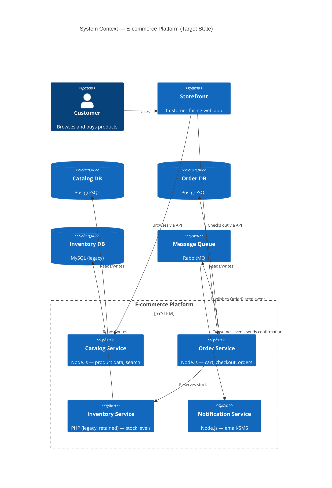
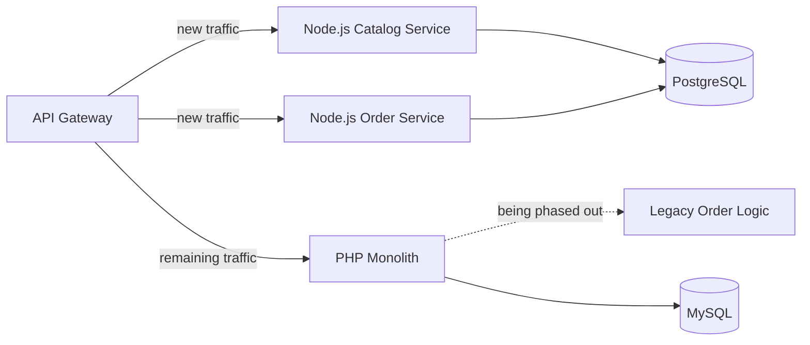

# System Design: PHP Monolith → Node.js Microservices Migration

**Status:** Case study / reference design
**Author:** Roma Banwani
**Related ADRs:** [0001](decisions/0001-migration-strategy.md) · [0002](decisions/0002-message-queue-selection.md) · [0003](decisions/0003-database-per-service.md)

---

## 1. Context

A legacy e-commerce platform has run as a single PHP (Laravel) monolith for several years.
It handles product catalog, orders, inventory, and notifications in one codebase against a
single MySQL database.

**Pain points driving this design:**
- Deploys are slow and risky — a bug in the notification code can take down checkout
- The team can't scale individual hot paths (e.g. order processing) independently
- Onboarding new engineers is hard due to tight coupling across modules
- Inventory and catalog have very different read/write patterns but share one database

## 2. Requirements

**Functional**
- Preserve all existing functionality during migration — no feature regression
- Support independent deployment of order, inventory, and notification logic
- Handle traffic spikes on checkout/order flows without affecting catalog browsing

**Non-functional**
- Zero-downtime migration (cannot take the store offline)
- 99.9% uptime target for checkout flow specifically
- Migration must be incremental — cannot be a single "big bang" rewrite

## 3. High-Level Architecture

**Key design decisions reflected above:**
- Inventory stays on PHP/MySQL initially (see [ADR-0001](decisions/0001-migration-strategy.md)) — not every service needs to move on day one
- Services communicate synchronously (REST) for read paths and asynchronously (queue) for
  write-side side effects like notifications, to avoid cascading failures
- Each new service owns its own database — no more shared-database coupling

## 4. Migration Strategy (Strangler Fig Pattern)

Rather than a rewrite, traffic is incrementally routed away from the monolith service-by-service:

An API gateway sits in front of both the monolith and new services, routing by route/domain.
As each domain is extracted and proven stable, its routes move from monolith → new service,
and the corresponding monolith code is deleted. This keeps the system releasable and rollback-able
at every step, rather than betting everything on a single cutover.

## 5. Trade-offs Considered

| Option | Pros | Cons | Decision |
|---|---|---|---|
| Big-bang rewrite | Clean slate, no dual-maintenance | High risk, long freeze on features, hard rollback | Rejected |
| Strangler fig (incremental) | Low risk, always shippable, easy rollback | Temporary complexity running both systems | **Chosen** |
| Keep monolith, add caching only | Fast, low effort | Doesn't solve the deploy-coupling or scaling problem | Rejected |

## 6. What I'd Watch For in Production

- **Dual-write consistency** during the transition window (e.g. order data existing in both
  systems briefly) — mitigated with an outbox pattern and idempotent event consumers
- **Latency from added network hops** — mitigated by keeping tightly-coupled reads (e.g. product
  + price) in the same service rather than over-decomposing
- **Team ownership boundaries** — each service should map to a team that can own it end-to-end,
  otherwise microservices just move the coupling problem into deployment coordination

---

*This is a reference design based on a common real-world migration pattern. Diagrams render
directly on GitHub via Mermaid.*
